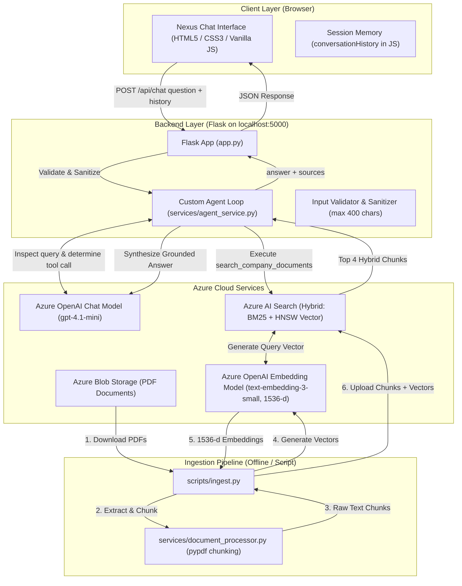

# Company AI Assistant — RAG + AI Agent on Microsoft Azure

> **Course & Topic:** Chitkara University — INBIOT AI-103 Group Project (Topic 28: Enterprise Knowledge Agent)  
> **Repository:** [https://github.com/Bhavyakakkar24/Enterprise-knowledge-agent](https://github.com/Bhavyakakkar24/Enterprise-knowledge-agent)  
> **Live Demo:** [https://nexus-b4d2b3agctd9dea3.uaenorth-01.azurewebsites.net](https://nexus-b4d2b3agctd9dea3.uaenorth-01.azurewebsites.net)  
> **Demo Video:** TODO (YouTube link to be added)

A working, hardened enterprise AI assistant built with **Flask**, **Microsoft Entra ID (MSAL)**, **Azure OpenAI (Microsoft Foundry)**, **Azure AI Search**, and **Azure Blob Storage**, deployed to **Azure App Service**. Employees can sign in via Microsoft SSO, explore the marketing landing page, and ask questions in a modern web chat interface; a custom tool-calling agent loop inspects the query, retrieves relevant policy chunks via **Hybrid Search (BM25 + Dense Vector)**, and synthesizes accurate, grounded answers citing verified sources.

---

## Team Information

| Team Name | TODO |
| :--- | :--- |

| # | Team Member | Contribution / Role |
| :-: | :--- | :--- |
| 1 | **Bhavya Kakkar** | Designed and implemented the custom AI agent loop (services/agent_service.py) and the Flask API (app.py), including tool-calling logic, the 3-iteration cap, conversation history handling, and input validation. |
| 2 | **Saamya Singh** | Set up and configured all Azure resources (Foundry deployments, Blob Storage, Azure AI Search), managed environment configuration and secrets (config.py, .env.example, .gitignore), and maintained the GitHub repository. |
| 3 | **Varinda Dhir** | Designed and built the frontend chat interface (templates/index.html, static/style.css, static/app.js), including the sources panel, loading states, and error recovery. |
| 4 | **Garima Sharma** | Built the document ingestion pipeline: PDF text extraction and chunking (services/document_processor.py), embedding generation (services/embedding_service.py), and hybrid search with Azure AI Search (services/search_service.py, scripts/ingest.py). |
| 5 | **Shriya Chhabra** | Conducted end-to-end testing of the assistant, verified answers against source documents, and wrote the project documentation including limitations, responsible AI considerations, and testing results. |

> **AI Assistants Used During Development:**  
> * **Antigravity** (an agentic AI coding environment) was used for code implementation and Git commits.  
> * **Claude** (Anthropic) was used for project planning, the day-wise roadmap, and step-by-step guidance.  
> * All AI-generated code was reviewed and tested by the team.

---

## 1. Problem Statement & Solution Overview

### Problem Statement
In modern enterprises, employees lose valuable working time manually searching through long, fragmented corporate policy documents (e.g., HR manuals, IT security standards, codes of conduct, and travel & expense guidelines). This manual search process leads to:
* **Productivity Loss:** Employees spend significant time hunting across multiple lengthy PDF documents to find specific answers.
* **Inconsistent Answers:** Different employees receive conflicting or outdated information depending on whom they ask or which document version they view.
* **Hallucinations from General Chatbots:** Public AI chatbots lack access to internal company rules and frequently invent non-existent company policies.

### Solution Overview
The **Company AI Assistant (Nexus)** is an internal enterprise tool that enables employees to query official company documentation using natural language:
* **Grounded Answers:** When asked about company policies, the assistant executes a search against indexed company documents in Azure AI Search and bases its response strictly on verified text chunks.
* **Source Citations:** Every document-grounded response includes collapsible source references indicating the document name, chunk ID, and page number.
* **Direct Knowledge Routing:** For general queries (such as general technical definitions, math, or trivia), the assistant responds directly without invoking search tools.
* **Safe Missing Information Handling:** If the indexed documents do not contain the answer, the assistant clearly states that the documents do not cover the topic rather than guessing.
* **Multi-Turn Conversation Memory:** Users can ask follow-up questions within the same session with recent context carried forward.

### Indexed Policy Documents
The system indexes four core corporate policy documents created for Acme Corp:
* **`sample_hr_policy.pdf`**: Working hours, remote/hybrid work schedules, paid time off, parental and bereavement leave, performance reviews, and resignation notice periods.
* **`sample_it_security_policy.pdf`**: Multi-factor authentication (MFA), password complexity requirements, device management (BYOD/MDM), data classification, and incident reporting.
* **`sample_code_of_conduct.pdf`**: Workplace conduct, non-discrimination, harassment reporting, conflicts of interest, and gift acceptance/anti-bribery thresholds.
* **`sample_expense_travel_policy.pdf`**: Business travel approval tiers, domestic and international per diem meal allowances, flight/hotel booking guidelines, and mileage reimbursements.

---

## 2. AI-103 Concepts Applied

The following core AI-103 concepts are implemented and verified in this codebase:

| AI-103 Concept | Implementation in this Project | Verified Source File(s) |
| :--- | :--- | :--- |
| **Generative AI & LLM Reasoning** | Uses a Microsoft Foundry-deployed chat model (`gpt-4.1-mini`) for intent classification, tool decision-making, and grounded response synthesis. | [`services/agent_service.py`](services/agent_service.py) |
| **Dense Vector Embeddings** | Generates 1536-dimensional semantic dense vectors using `text-embedding-3-small` for both offline PDF chunk indexing and online search queries. | [`services/embedding_service.py`](services/embedding_service.py)<br>[`scripts/ingest.py`](scripts/ingest.py) |
| **Retrieval-Augmented Generation (RAG)** | Implements an end-to-end RAG pattern: user query &rarr; query embedding &rarr; Azure AI Search retrieval &rarr; context injection &rarr; grounded answer with source citations. | [`services/agent_service.py`](services/agent_service.py)<br>[`services/search_service.py`](services/search_service.py) |
| **Hybrid Search (BM25 + Dense Vectors)** | Combines lexical keyword matching (BM25) with vector search (HNSW cosine similarity) using Reciprocal Rank Fusion (RRF) for optimal precision on policy codes, numbers, and conceptual queries. | [`services/search_service.py`](services/search_service.py) |
| **AI Agent & Tool Calling** | Custom agent loop using model tool calling (`search_company_documents`). The agent autonomously decides whether to search or answer directly, with an execution cap of 3 iterations to prevent infinite loops. | [`services/agent_service.py`](services/agent_service.py) |
| **Enterprise Auth & Access Control** | Microsoft Entra ID (Azure AD) OAuth 2.0 via MSAL (authorization code flow). Enforces `@login_required` on `/chat` and `/api/chat`, and gates access using an `ALLOWED_USER_EMAILS` allow-list. | [`auth.py`](auth.py)<br>[`app.py`](app.py)<br>[`config.py`](config.py) |
| **Responsible AI & Guardrails** | Implements input validation (400 chars max), history sanitization (1500 chars/msg, 10 messages max, user/assistant role filtering), private blob storage, timeout protections (30s/10s), and "not found" fallback handling. | [`app.py`](app.py)<br>[`services/agent_service.py`](services/agent_service.py)<br>[`config.py`](config.py) |

---

## 3. Architecture & Ingestion Flow



### Search Mode Implementation Details
As implemented in [`services/search_service.py`](services/search_service.py), queries execute **Hybrid Search**:
1. Generates a 1536-dimensional query embedding via `EmbeddingService` (`text-embedding-3-small`).
2. Dispatches a combined query containing `search_text` (BM25 keyword search) and `vector_queries` (`VectorizedQuery` with HNSW cosine similarity) to Azure AI Search.
3. Combines keyword scores and vector similarity using **Reciprocal Rank Fusion (RRF)** to return the top 4 most relevant chunks.
4. Includes fallback handlers for vector-only or text-only execution if hybrid execution encounters an exception.

---

## 4. Search Methods: Keyword vs. Vector vs. Hybrid

| Search Method | How It Works | Strengths | Limitations |
| :--- | :--- | :--- | :--- |
| **Keyword Search (BM25)** | Matches exact terms and token frequencies in documents. | Perfect for exact policy codes, document IDs, acronyms (e.g., `ACME-IT-002`, `MFA`, `$75`, `$1,000`). | Misses synonyms or semantic intent (e.g. searching "vacation" might miss a section titled "Annual Leave"). |
| **Vector Search (Dense / HNSW)** | Converts text into mathematical vectors capturing semantic meaning. | Finds conceptually related chunks even when exact keywords differ (e.g., "taking time off" matches "Paid Time Off"). | Can perform poorly on specific policy codes, numeric thresholds, or exact abbreviations. |
| **Hybrid Search (BM25 + Vector)** *(Used in this project)* | Runs both BM25 and Vector search in parallel and merges results using **Reciprocal Rank Fusion (RRF)**. | **Best of both worlds:** captures both exact keyword matches and conceptual phrasing. | Requires generating embeddings for queries and storing vector fields in the index. |

**Why this project uses Hybrid Search:** Enterprise policies contain both exact terminology (e.g., "$75 gift limit", "12 characters", "Anchor Days", "30 calendar days") and semantic descriptions (e.g., "Can I work from home?"). Hybrid search ensures both types of queries retrieve relevant passages.

---

## 5. Custom Agent Loop vs. Azure Foundry Agent Service

Microsoft Foundry Agent Service is a fully managed cloud service that hosts autonomous AI agents with managed memory, tool execution, and thread storage on Azure infrastructure.

This project deliberately implements a **custom Python agent loop** built inside Flask using model function/tool calling (`search_company_documents`) for several specific reasons:

1. **Full Operational Control & Predictability:** The loop enforces an exact maximum of 3 tool iterations ([`services/agent_service.py`](services/agent_service.py)), preventing infinite execution loops or runaway API token consumption.
2. **Deterministic Timeouts & Error Recovery:** Custom client timeouts (30s for model calls, 10s for search) prevent hung requests and allow clean JSON error handling for 400, 429, 500, 502, and 504 responses.
3. **Stateless & Transparent:** The server maintains no black-box server-side assistant state or persistent threads in the cloud, avoiding vendor orchestration lock-in and extra orchestration costs.
4. **Local Inspectability:** Request logs track duration, status codes, tool call counts, and truncated queries directly in the application console.

---

## 6. Technology Stack & Azure Services

### Runtime & Core Frameworks
* **Python Version:** `Python 3.12+` (Tested on Windows with PowerShell).
* **Backend:** Flask (`flask>=3.0.0`) REST API server.
* **Frontend:** Plain HTML5, CSS3, and Vanilla JavaScript (`fetch` API).

### Python Dependencies ([`requirements.txt`](requirements.txt))
| Package Name | Minimum Version | Purpose in Solution |
| :--- | :--- | :--- |
| `flask` | `>=3.0.0` | Backend web framework, REST routing, and static UI file serving. |
| `python-dotenv` | `>=1.0.0` | Loads secrets and configuration from local `.env` into environment variables. |
| `msal` | `>=1.28.0` | Microsoft Authentication Library for Python to authenticate users via Microsoft Entra ID. |
| `openai` | `>=1.14.0` | Official client SDK for Azure OpenAI / Foundry chat completions and embeddings. |
| `azure-storage-blob` | `>=12.19.0` | Official SDK to connect to Azure Blob Storage and upload/download PDF documents. |
| `azure-search-documents` | `>=11.4.0` | Official SDK to create indexes, upload chunk payloads, and perform hybrid searches. |
| `azure-identity` | `>=1.15.0` | Authentication library for Azure service clients. |
| `pypdf` | `>=4.1.0` | Pure-Python PDF parsing library used for text extraction across pages. |
| `httpx2` *(Dependency)* | Underlying SDK | Low-level HTTP transport library used by the OpenAI SDK. |

### Azure AI Services & Cloud Models
| Azure Resource | Model / Deployment Name | Configuration & Specifications |
| :--- | :--- | :--- |
| **Azure AI Foundry / Azure OpenAI** | `gpt-4.1-mini` | Chat completion, intent recognition, tool calling, and grounded response synthesis. |
| **Azure AI Foundry / Azure OpenAI** | `text-embedding-3-small` | Dense vector embedding generation (**1536 dimensions**). |
| **Azure AI Search** | `company-knowledge-index` | Hybrid index combining BM25 keyword search and HNSW vector similarity. |
| **Azure Blob Storage** | `company-docs` | Private cloud container for source policy PDF documents. |

*(All keys, endpoints, and credentials are configured via environment variables; no secrets or real endpoints are stored in source code.)*

---

## 7. Prerequisites & Azure Portal Guide

### Prerequisites
* **Python 3.12+** on Windows (PowerShell recommended).
* **Active Azure Subscription** with access to create resources.
* **Azure AI Foundry (or Azure OpenAI) Resource** with:
  * Chat completion model deployment (`gpt-4.1-mini`).
  * Embedding model deployment (`text-embedding-3-small`).
* **Azure AI Search Service** (Basic tier or Free tier).
* **Azure Storage Account** with Blob Storage enabled.

### Where to Find `.env` Values in the Azure Portal

| Environment Variable | Where to Find in Azure Portal | Example Format |
| :--- | :--- | :--- |
| `AZURE_OPENAI_ENDPOINT` | Azure AI Foundry / OpenAI resource &rarr; **Resource Management** &rarr; **Keys and Endpoint** &rarr; **Endpoint** | `https://<your-resource>.services.ai.azure.com` |
| `AZURE_OPENAI_API_KEY` | Azure AI Foundry / OpenAI resource &rarr; **Resource Management** &rarr; **Keys and Endpoint** &rarr; **Key 1** | `32-character hex key` |
| `AZURE_OPENAI_API_VERSION` | OpenAI API version date (optional in config, recommended: `2024-02-15-preview`) | `2024-02-15-preview` |
| `AZURE_OPENAI_CHAT_DEPLOYMENT` | Azure AI Foundry Portal &rarr; **Deployments** &rarr; Name of your deployed chat model | `gpt-4.1-mini` |
| `AZURE_OPENAI_EMBEDDING_DEPLOYMENT` | Azure AI Foundry Portal &rarr; **Deployments** &rarr; Name of your deployed embedding model | `text-embedding-3-small` |
| `AZURE_OPENAI_EMBEDDING_DIMENSIONS` | Embedding output dimensions for `text-embedding-3-small` | `1536` |
| `AZURE_STORAGE_CONNECTION_STRING` | Storage Account &rarr; **Security + networking** &rarr; **Access keys** &rarr; **Connection string** (Key 1 or 2) | `DefaultEndpointsProtocol=https;AccountName=...` |
| `AZURE_STORAGE_CONTAINER_NAME` | Storage Account &rarr; **Data storage** &rarr; **Containers** &rarr; Name of your private blob container | `company-docs` |
| `AZURE_SEARCH_ENDPOINT` | Azure AI Search service &rarr; **Overview** &rarr; **Url** | `https://<search-service>.search.windows.net` |
| `AZURE_SEARCH_API_KEY` | Azure AI Search service &rarr; **Settings** &rarr; **Keys** &rarr; **Primary admin key** | `52-character key` |
| `AZURE_SEARCH_INDEX_NAME` | Name for the search index to create and query | `company-knowledge-index` |
| `FLASK_PORT` | Local port for Flask server | `5000` |
| `FLASK_DEBUG` | Local debug mode flag (`False` recommended) | `False` |
| `FLASK_SECRET_KEY` | Secret key for Flask session signing | `32-character random string` |
| `ENTRA_CLIENT_ID` | Azure Portal &rarr; **Microsoft Entra ID** &rarr; **App registrations** &rarr; Selected App &rarr; **Application (client) ID** | `36-char UUID (e.g. c701598b-...)` |
| `ENTRA_CLIENT_SECRET` | Azure Portal &rarr; **Microsoft Entra ID** &rarr; **App registrations** &rarr; Selected App &rarr; **Certificates & secrets** &rarr; **Value** column | `40-character secret value` |
| `ENTRA_TENANT_ID` | Azure Portal &rarr; **Microsoft Entra ID** &rarr; **App registrations** &rarr; Selected App &rarr; **Directory (tenant) ID** | `36-char UUID (e.g. bc9cd8e7-...)` |
| `ENTRA_REDIRECT_URI` | Azure Portal &rarr; **App registrations** &rarr; **Authentication** &rarr; Web Redirect URIs | `http://localhost:5000/auth/callback` (Local)<br>`https://<app-name>.azurewebsites.net/auth/callback` (Production) |
| `ALLOWED_USER_EMAILS` | Comma-separated list of authorized employee/student emails allowed to sign in | `user1@acme.com,user2@acme.com` |

---

## 8. Setup & Installation (PowerShell on Windows)

### 1. Clone the Repository
```powershell
git clone https://github.com/Bhavyakakkar24/Enterprise-knowledge-agent.git
cd Enterprise-knowledge-agent
```

### 2. Create and Activate Virtual Environment
```powershell
python -m venv .venv
.\.venv\Scripts\Activate.ps1
```

### 3. Install Dependencies
```powershell
pip install -r requirements.txt
```

### 4. Configure Environment Variables
Create your local `.env` configuration file from `.env.example`:
```powershell
Copy-Item .env.example .env
```
Fill in the credentials as located using the portal guide in Section 7.

> **Note on Local vs. Production Execution:**
> * For **local development**, [`app.py`](app.py) runs on `http://localhost:5000`.
> * `FLASK_DEBUG` defaults to `False`. To enable the interactive debug reloader locally, set `FLASK_DEBUG=True` in `.env`.

### 5. Verify Connectivity (Optional Diagnostic)
```powershell
python scripts/check_foundry.py
```

### 6. Upload Documents to Azure Blob Storage
Uploads source PDFs from `data/sample_docs/` to the Blob Storage container (`scripts/upload_to_blob.py` uploads every PDF found in `data/sample_docs/`, and the four sample policy documents are included in the repository):
```powershell
python scripts/upload_to_blob.py
```

### 7. Run Document Ingestion Pipeline
Extracts text from PDFs, creates chunks (~900 chars with 150 char overlap), generates 1536-d embeddings, and indexes them in Azure AI Search:
```powershell
python scripts/ingest.py
```

### 8. Start the Local Web Application
```powershell
python app.py
```
Open your browser and navigate to: **`http://localhost:5000`**

---

### 9. Production Deployment (Azure App Service)

The application is deployed and actively running on **Azure App Service**:
* **Hosting Platform:** Azure App Service (Linux B1 tier, Python 3.12).
* **WSGI Production Server:** Hosted via **Gunicorn** (automatically detected and launched by Azure's Oryx build system).
* **Dynamic Port Handling:** [`app.py`](app.py) dynamically reads `port = int(os.environ.get("PORT", config.FLASK_PORT))` assigned by Azure at runtime.
* **Production Configuration:** All Azure credentials, Entra ID keys, and allow-lists are injected directly through Azure App Service &rarr; **Settings** &rarr; **Environment variables** (no `.env` file exists on the production host).
* **Automated CI/CD Pipeline:** Configured via **GitHub Actions** (`.github/workflows/main_nexus.yml`), automatically building, archiving dependencies, and deploying upon every push to the `main` branch.
* **Live Production URL:** [https://nexus-b4d2b3agctd9dea3.uaenorth-01.azurewebsites.net](https://nexus-b4d2b3agctd9dea3.uaenorth-01.azurewebsites.net)

---


## 9. Demo & Test Questions

| # | Document & Topic | Sample Question | Expected Assistant Behavior & Citations |
| :--- | :--- | :--- | :--- |
| 1 | **HR Policy**<br>*(Annual Leave)* | *"How many days of paid annual leave do full-time employees receive?"* | Answers **25 days per calendar year** (accrued at 2.08 days/month).<br>&bull; Source: `sample_hr_policy.pdf` (Page 2) |
| 2 | **HR Policy**<br>*(Remote & Hybrid)* | *"What is the hybrid work schedule and what are Anchor Days?"* | Answers up to **3 days remote / 2 days in-office** with mandatory Anchor Days (Tuesdays/Thursdays).<br>&bull; Source: `sample_hr_policy.pdf` (Page 1) |
| 3 | **HR Policy**<br>*(Home Office Stipend)* | *"How much is the home office setup reimbursement?"* | Answers **$500 USD one-time stipend** submitted within 60 days of hire.<br>&bull; Source: `sample_hr_policy.pdf` (Page 2) |
| 4 | **HR Policy**<br>*(Notice Period)* | *"What is the required notice period for resignation after probation?"* | Answers **30 calendar days (1 month)** for standard full-time staff (14 days during probation).<br>&bull; Source: `sample_hr_policy.pdf` (Page 3) |
| 5 | **IT & Security Policy**<br>*(MFA & Passwords)* | *"What are the password complexity requirements and is MFA required?"* | Answers passwords must be **minimum 12 characters** with uppercase, lowercase, numeric, and special characters; **MFA is mandatory** for corporate accounts, VPN, and cloud services.<br>&bull; Source: `sample_it_security_policy.pdf` (Page 1) |
| 6 | **Code of Conduct**<br>*(Gift Policy & Reporting)* | *"What is the monetary limit for accepting gifts from vendors or clients?"* | Answers gifts valued **under $75** may be accepted without approval; gifts **exceeding $75** must be reported to the manager.<br>&bull; Source: `sample_code_of_conduct.pdf` (Page 1) |
| 7 | **Expense & Travel Policy**<br>*(International Meals)* | *"What is the daily per diem meal allowance for international business travel?"* | Answers **$100 USD per day** for international travel (and $75 USD for domestic travel).<br>&bull; Source: `sample_expense_travel_policy.pdf` (Page 1) |
| 8 | **HR Policy**<br>*(Probationary Period)* | *"How long is the employee probationary period?"* | Answers **90 days** with performance reviews at 30, 60, and 90-day intervals.<br>&bull; Source: `sample_hr_policy.pdf` (Page 3) |
| 9 | **General Knowledge**<br>*(Math & Geography)* | *"What is the capital of France and what is 12 + 15?"* | Responds directly (**Paris** and **27**) without calling the search tool (`sources: []`). |
| 10 | **Out-of-Scope / Missing Info**<br>*(Non-existent Policy)* | *"What is Acme Corp's policy on bringing pet dragons to work?"* | Identifies that the topic is not found in company documentation and clearly states that the documents do not cover it (`sources: []`). |
| 11 | **Multi-Turn Context**<br>*(Follow-up Query)* | *User: "How many vacation days do I get?"*<br>*Follow-up: "Can I carry them over to next year?"* | Understands context from prior turn and explains the **5-day carryover limit** expiring March 31.<br>&bull; Source: `sample_hr_policy.pdf` (Page 2) |

---

## 10. Testing Checklist

The following runnable commands test each layer of the solution:

- [ ] **Test Azure Foundry Connectivity:**
  ```powershell
  python scripts/check_foundry.py
  ```
- [ ] **Upload PDFs to Blob Storage:**
  ```powershell
  python scripts/upload_to_blob.py
  ```
- [ ] **Run Ingestion & Search Indexing:**
  ```powershell
  python scripts/ingest.py
  ```
- [ ] **Run Hybrid Search Quality Diagnostic:**
  ```powershell
  python services/search_service.py
  ```
- [ ] **Run Terminal Chat Verification:**
  ```powershell
  python scripts/test_chat.py
  ```
- [ ] **Start Local Web Server:**
  ```powershell
  python app.py
  ```

---

## 11. Testing and Results

**Test Date:** 22 September 2026  
**Test Environment:** Windows 11, PowerShell, Python 3.14.7 (Python 3.12+ compatible), local Flask server running on `127.0.0.1:5000`.  
**Execution Method:** Tests 1–8 were executed programmatically against the running Flask API (`POST /api/chat`) using a test harness (`scratch/run_all_9_tests.py`), with real request logs, tool call counts, and search execution modes captured from the server. Test 3 was executed within the same conversation session as Test 1 to verify multi-turn history propagation. Test 9 was validated manually in the browser UI. All factual numbers were verified against the ground-truth PDFs in `data/sample_docs/`.

### Verified Test Results

| # | Test Scenario & Input Question | Actual Output Summary | Sources Returned | Tool Calls | Search Mode | Result |
| :-: | :--- | :--- | :--- | :-: | :--- | :-: |
| **1** | **Paid Annual Leave**<br>*"How many days of paid annual leave do full-time employees get?"* | Full-time employees at Acme Corp are entitled to **25 paid annual leave days** per calendar year. These days accrue at a rate of **2.08 days per completed month** of service. | `sample_hr_policy.pdf` (Page 2, 3) | 1 | Hybrid | **Pass** |
| **2** | **International Meal Allowance**<br>*"What is the daily meal allowance for international business travel?"* | The daily meal allowance (per diem) for international business travel at Acme Corp is **$100 USD per day**, covering breakfast, lunch, and dinner combined. | `sample_expense_travel_policy.pdf` (Page 1)<br>`sample_hr_policy.pdf` (Page 2) | 1 | Hybrid | **Pass** |
| **3** | **Follow-up (with Test 1 History)**<br>*"Can I carry unused days over to next year?"* | You may carry over a **maximum of 5 unused annual leave days** into the next calendar year. These carried-over days **must be used before March 31** of that new year, or they will lapse. | `sample_hr_policy.pdf` (Page 2, 3) | 1 | Hybrid | **Pass** |
| **4** | **General Technical Definition**<br>*"What is a firewall?"* | Correctly defined a firewall as a network security device/software that monitors and controls incoming/outgoing network traffic based on predetermined security rules. | `[]` (None) | 0 | None (Direct) | **Pass** |
| **5** | **Missing / Out-of-Scope Policy**<br>*"What is the company's policy on stock option vesting?"* | Correctly stated that information regarding stock option vesting could not be found in the available company documentation. | `[]` (None) | 1 | Hybrid | **Pass** |
| **6** | **Ambiguous General Concept**<br>*"What's an agent?"* | Explained that "agent" has different meanings depending on context (software, business, real estate) and asked for clarification. | `[]` (None) | 0 | None (Direct) | **Pass** |
| **7** | **Empty Input Validation**<br>*`"   "` (whitespace only)* | Server rejected with **HTTP 400 Bad Request**: `"The 'question' parameter cannot be empty or whitespace only."` | N/A | 0 | None | **Pass** |
| **8** | **Input Length Validation**<br>*Question exceeding 400 characters (410 chars)* | Server rejected with **HTTP 400 Bad Request**: `"Question exceeds maximum allowed length of 400 characters."` | N/A | 0 | None | **Pass** |
| **9** | **Server Down UI Recovery**<br>*Server stopped, question sent from UI* | Browser UI displayed `"Unable to connect to the assistant server. Please verify that the server is running."` and re-enabled the input box and send button. | N/A | N/A | N/A | **Pass** *(Manual)* |

---

## 12. Responsible AI & Safety Controls

This project implements Responsible AI principles, grounded directly in verified code implementations across privacy, security, fairness, transparency, reliability, and human oversight:

### 1. Privacy & Data Governance
* **Private Cloud Storage:** Source policy PDFs reside exclusively in a private Azure Blob Storage container (`company-docs`) with public anonymous access disabled.
* **Localhost & TLS/HTTPS:** For local development, Flask binds locally (`127.0.0.1:5000`); in production on Azure App Service, all communication is strictly enforced over HTTPS with automated TLS certificate management.
* **Zero Secret Leakage in Logs:** Application logging explicitly redacts sensitive request headers and logs only non-sensitive metadata (timestamp, endpoint, status code, duration, tool call count, truncated question). HTTP client loggers (`httpx2`, `azure.core`) are set to `WARNING` level to prevent logging sensitive authorization headers or document tokens.

### 2. Security & Guardrails
* **Microsoft Entra ID Authentication & Email Allow-List:** User access is protected using Microsoft Entra ID (MSAL authorization code flow) in [`auth.py`](auth.py). Following Microsoft authentication, user email claims are verified against an explicit `ALLOWED_USER_EMAILS` allow-list. Unauthenticated visits to `/chat` redirect to `/login`, and `/api/chat` returns HTTP 401 Unauthorized.
* **Strict Input Length Limits:** Incoming questions are capped at 400 characters (`MAX_QUESTION_LENGTH = 400`) in [`services/agent_service.py`](services/agent_service.py), rejecting buffer overflow attempts or oversized prompt injection payloads via HTTP 400.
* **Role-Restricted History Sanitization:** The `sanitize_history()` function accepts only `"user"` and `"assistant"` message roles from the client payload, silently discarding any client-injected `"system"` or `"tool"` roles.
* **Context Budget Caps:** History turns are limited to `MAX_HISTORY_TURNS = 10` messages (5 Q&A turns) and truncated to `MAX_HISTORY_CHARS = 1500` characters per turn to protect model context windows.

### 3. Reliability & System Stability
* **Loop Prevention Cap:** The agent tool-calling loop is strictly capped at a maximum of 3 iterations (`MAX_TOOL_ITERATIONS = 3`), guaranteeing that the agent will never enter an unbounded recursive loop.
* **Client Timeouts:** Network calls enforce deterministic timeouts (30 seconds for Azure OpenAI chat completions, 10 seconds for Azure AI Search), preventing requests from hanging indefinitely on network failure.
* **Search Fallback Cascade:** If Azure AI Search hybrid search fails, the system automatically falls back to vector-only and then keyword-only search, logging the executed mode and exception type.

### 4. Transparency & Explainability
* **Verifiable Source Citations:** Every document-grounded response includes source metadata referencing the source document filename and page number, enabling employees to cross-verify answers against official documents.
* **Safe Missing Information Handling:** When documents do not contain the answer, the assistant clearly states the absence of information rather than inventing policies, and source citations are zeroed out (`sources: []`).

### Honest Gaps & Current Limitations
* **Role-Based Access Control (RBAC):** While authentication and email allow-listing are implemented via Microsoft Entra ID, granular role-based policy access control (e.g. restricting specific documents to designated departments) is not yet implemented.
* **Fictional Sample Documents:** All four policy documents are fictional sample documents for "Acme Corp" created for demonstration and academic evaluation.
* **Text-Match "Not Found" Filter:** Zeroing out citations on missing information relies on heuristic string matching (`is_not_found_response()`) rather than a dedicated secondary classifier.
* **Human Oversight Advice:** The assistant is an informational aid; employees should always consult human HR or IT representatives for binding organizational decisions.

---

## 13. Known Limitations

1. **Browser-Only Conversation Memory:** Conversation history is stored in the browser's JavaScript memory (`conversationHistory` in [`static/app.js`](static/app.js)). Refreshing the browser tab resets memory to an empty state.
2. **Conversation History Window:** [`services/agent_service.py`](services/agent_service.py) caps conversation history at `MAX_HISTORY_TURNS = 10` messages (which equals **5 question-and-answer pairs / turns**) and truncates each individual message to **1500 characters** (`MAX_HISTORY_CHARS = 1500`) to prevent context window overflow.
3. **Sources List Granularity:** The returned `sources` list contains all unique chunks retrieved during the search tool call (`top_k=4`), rather than narrowing down to specific sentences cited in the final generated text.
4. **Text-Match "Not Found" Detection:** Zeroing out sources for unanswerable questions relies on string pattern matching (`is_not_found_response()` in [`services/agent_service.py`](services/agent_service.py)).
5. **Search Fallback Execution:** If hybrid search encounters an error, [`services/search_service.py`](services/search_service.py) falls back gracefully to vector-only search, followed by keyword-only search. The service logs an `INFO` line indicating which search mode actually executed (`Search mode: hybrid`, `Search mode: vector-only (fallback)`, or `Search mode: keyword-only (fallback)`) and logs a `WARNING` with the exception type whenever a fallback is triggered.
6. **Search Index Capacity & Quotas:** Subject to the provisioned tier and partition quota of the Azure AI Search resource.
7. **Text-Based PDF Processing:** Text extraction relies on `pypdf`. Scanned image-only PDFs without an OCR text layer will yield empty text chunks.
8. **Granular RBAC:** All allow-listed users currently have access to all four indexed policy documents; fine-grained per-document or departmental permissions are not enforced.
9. **Development Server vs. Production:** When running locally via `python app.py`, Flask runs the built-in development server. In production on Azure App Service, the application is hosted with Gunicorn WSGI.
10. **HTTP Logging Hygiene:** Debug-level logging for HTTP client libraries (`httpx`, `azure.core`) should remain disabled to prevent sensitive tokens or request bodies from being output to terminal logs.

---

## 14. Future Improvements

* **Foundry IQ & MCP Retrieval Architecture:** In future iterations, migrate document retrieval to a managed **Foundry IQ** knowledge base on Azure AI Search and expose it to agent workflows through **Model Context Protocol (MCP)**. *(Note: This current project implements the entire retrieval and chunking pipeline manually via the Azure Python SDKs in [`services/search_service.py`](services/search_service.py) and [`scripts/ingest.py`](scripts/ingest.py) and does not currently use Foundry IQ or MCP).*
* **Persistent User Sessions:** Integrate database-backed history storage (e.g. Azure Cosmos DB or PostgreSQL) keyed by session IDs or authenticated user accounts.
* **OCR & Document Intelligence:** Integrate Azure AI Document Intelligence for parsing complex tables, scanned images, and multi-column DOCX/PDF layouts.
* **Streaming Responses:** Implement Server-Sent Events (SSE) in `app.py` and `app.js` for token-by-token streaming responses.
* **Sentence-Level Source Attribution:** Use model-generated citation markers `[1]`, `[2]` mapped directly to specific retrieved chunks.
* **Containerization:** Containerize with Docker and deploy to Azure Container Apps or Kubernetes for containerized microservice architectures (standard Azure App Service deployment is currently live).


---

## 15. Acknowledgements

* **Open-Source Libraries & Frameworks:**
  * [Flask](https://flask.palletsprojects.com/) (Web framework and REST API)
  * [python-dotenv](https://github.com/theskumar/python-dotenv) (Environment variable management)
  * [OpenAI Python SDK](https://github.com/openai/openai-python) (Azure OpenAI integration)
  * [azure-storage-blob](https://github.com/Azure/azure-sdk-for-python/tree/main/sdk/storage/azure-storage-blob) (Azure Blob Storage client)
  * [azure-search-documents](https://github.com/Azure/azure-sdk-for-python/tree/main/sdk/search/azure-search-documents) (Azure AI Search client)
  * [azure-identity](https://github.com/Azure/azure-sdk-for-python/tree/main/sdk/identity/azure-identity) (Azure Identity client)
  * [pypdf](https://github.com/py-pdf/pypdf) (PDF text extraction and parsing)
  * [httpx2](https://github.com/encode/httpx) (Underlying HTTP transport library for OpenAI SDK)
  * [Mermaid.js](https://mermaid.js.org/) (Architecture diagram rendering)
* **Documentation & Cloud Infrastructure:**
  * [Microsoft Azure Documentation](https://learn.microsoft.com/azure/) for Azure AI Search, Azure OpenAI, and Azure Blob Storage SDKs.
* **Sample Data Disclaimer:**
  * The four policy PDF documents (`sample_hr_policy.pdf`, `sample_it_security_policy.pdf`, `sample_code_of_conduct.pdf`, `sample_expense_travel_policy.pdf`) are fictional sample corporate documents created for "Acme Corp" specifically for this university project.
* **AI Assistants Used During Development:**
  * **Antigravity** (an agentic AI coding environment) was used for code implementation and Git commits.
  * **Claude** (Anthropic) was used for project planning, the day-wise roadmap, and step-by-step guidance.
  * All AI-generated code was reviewed and tested by the team.
