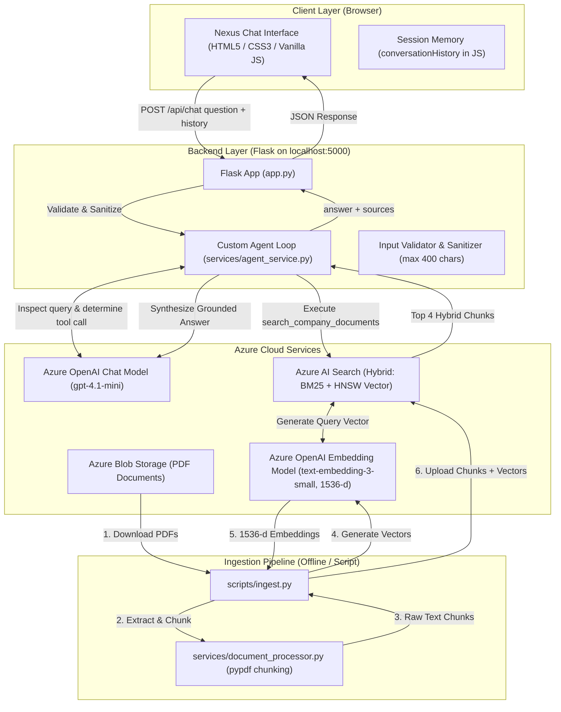

# Company AI Assistant — RAG + AI Agent on Microsoft Azure

A working, hardened enterprise AI assistant built with **Flask**, **Azure OpenAI (Microsoft Foundry)**, **Azure AI Search**, and **Azure Blob Storage**. Employees can ask questions in a modern web chat interface; a custom tool-calling agent loop inspects the query, retrieves relevant policy chunks via **Hybrid Search (BM25 + Dense Vector)**, and synthesizes accurate, grounded answers citing verified sources.

---

## 1. Overview

The **Company AI Assistant (Nexus)** is an internal enterprise tool that enables employees to query official company documentation using natural language. The system indexes four core corporate policy documents:
* **`sample_hr_policy.pdf`**: Working hours, remote/hybrid work schedules, paid time off, parental and bereavement leave, performance reviews, and resignation notice periods.
* **`sample_it_security_policy.pdf`**: Multi-factor authentication (MFA), password complexity requirements, device management (BYOD/MDM), data classification, and incident reporting.
* **`sample_code_of_conduct.pdf`**: Workplace conduct, non-discrimination, harassment reporting, conflicts of interest, and gift acceptance/anti-bribery thresholds.
* **`sample_expense_travel_policy.pdf`**: Business travel approval tiers, domestic and international per diem meal allowances, flight/hotel booking guidelines, and mileage reimbursements.

### Key Capabilities
* **Grounded Answers:** When asked about company policies, the assistant executes a search against indexed company documents in Azure AI Search and bases its response strictly on verified text chunks.
* **Source Citations:** Every document-grounded response includes collapsible source references indicating the document name, chunk ID, and page number.
* **Direct Knowledge Routing:** For general queries (such as math or general trivia), the assistant responds directly without invoking search tools.
* **Safe Missing Information Handling:** If the indexed documents do not contain the answer, the assistant clearly states that the documents do not cover the topic rather than guessing.
* **Multi-Turn Conversation Memory:** Users can ask follow-up questions within the same session with recent context carried forward.

---

## 2. Architecture & Ingestion Flow



### Search Mode Implementation Details
As implemented in [`services/search_service.py`](services/search_service.py), queries execute **Hybrid Search**:
1. Generates a 1536-dimensional query embedding via `EmbeddingService` (`text-embedding-3-small`).
2. Dispatches a combined query containing `search_text` (BM25 keyword search) and `vector_queries` (`VectorizedQuery` with HNSW cosine similarity) to Azure AI Search.
3. Combines keyword scores and vector similarity using **Reciprocal Rank Fusion (RRF)** to return the top 4 most relevant chunks.
4. Includes fallback handlers for vector-only or text-only execution if hybrid execution encounters an exception.

---

## 3. Search Methods: Keyword vs. Vector vs. Hybrid

| Search Method | How It Works | Strengths | Limitations |
| :--- | :--- | :--- | :--- |
| **Keyword Search (BM25)** | Matches exact terms and token frequencies in documents. | Perfect for exact policy codes, document IDs, acronyms (e.g., `ACME-IT-002`, `MFA`, `$75`, `$1,000`). | Misses synonyms or semantic intent (e.g. searching "vacation" might miss a section titled "Annual Leave"). |
| **Vector Search (Dense / HNSW)** | Converts text into mathematical vectors capturing semantic meaning. | Finds conceptually related chunks even when exact keywords differ (e.g., "taking time off" matches "Paid Time Off"). | Can perform poorly on specific policy codes, numeric thresholds, or exact abbreviations. |
| **Hybrid Search (BM25 + Vector)** *(Used in this project)* | Runs both BM25 and Vector search in parallel and merges results using **Reciprocal Rank Fusion (RRF)**. | **Best of both worlds:** captures both exact keyword matches and conceptual phrasing. | Requires generating embeddings for queries and storing vector fields in the index. |

**Why this project uses Hybrid Search:** Enterprise policies contain both exact terminology (e.g., "$75 gift limit", "12 characters", "Anchor Days", "30 calendar days") and semantic descriptions (e.g., "Can I work from home?"). Hybrid search ensures both types of queries retrieve relevant passages.

---

## 4. Custom Agent Loop vs. Azure Foundry Agent Service

Microsoft Foundry Agent Service is a fully managed cloud service that hosts autonomous AI agents with managed memory, tool execution, and thread storage on Azure infrastructure.

This project deliberately implements a **custom Python agent loop** built inside Flask using model function/tool calling (`search_company_documents`) for several specific reasons:

1. **Full Operational Control & Predictability:** The loop enforces an exact maximum of 3 tool iterations ([`services/agent_service.py`](services/agent_service.py)), preventing infinite execution loops or runaway API token consumption.
2. **Deterministic Timeouts & Error Recovery:** Custom client timeouts (30s for model calls, 10s for search) prevent hung requests and allow clean JSON error handling for 400, 429, 500, 502, and 504 responses.
3. **Stateless & Transparent:** The server maintains no black-box server-side assistant state or persistent threads in the cloud, avoiding vendor orchestration lock-in and extra orchestration costs.
4. **Local Inspectability:** Request logs track duration, status codes, tool call counts, and truncated queries directly in the application console.

---

## 5. Azure Resources & Models

| Resource | Purpose | Configuration / Deployment |
| :--- | :--- | :--- |
| **Azure AI Foundry / OpenAI** | Chat completions & reasoning | Deployment: `gpt-4.1-mini` |
| **Azure AI Foundry / OpenAI** | Dense vector embedding generation | Deployment: `text-embedding-3-small` (1536 dimensions) |
| **Azure AI Search** | Hybrid index storage & RRF retrieval | Index: `company-knowledge-index` (HNSW + BM25) |
| **Azure Blob Storage** | Private object storage for source PDFs | Container: `company-docs` |

*(All endpoints and keys are configured via environment variables; no real secrets are stored in source code.)*

---

## 6. Prerequisites & Azure Portal Guide

### Prerequisites
* **Python 3.12+** on Windows (PowerShell recommended).
* **Active Azure Subscription** with access to create resources.
* **Azure AI Foundry (or Azure OpenAI) Resource** with:
  * Chat completion model deployment (`gpt-4.1-mini`).
  * Embedding model deployment (`text-embedding-3-small`).
* **Azure AI Search Service** (Basic tier or Free tier).
* **Azure Storage Account** with Blob Storage enabled.

### Where to Find `.env` Values in the Azure Portal

| Environment Variable | Where to Find in Azure Portal | Example Format |
| :--- | :--- | :--- |
| `AZURE_OPENAI_ENDPOINT` | Azure AI Foundry / OpenAI resource &rarr; **Resource Management** &rarr; **Keys and Endpoint** &rarr; **Endpoint** | `https://<your-resource>.services.ai.azure.com` |
| `AZURE_OPENAI_API_KEY` | Azure AI Foundry / OpenAI resource &rarr; **Resource Management** &rarr; **Keys and Endpoint** &rarr; **Key 1** | `32-character hex key` |
| `AZURE_OPENAI_API_VERSION` | OpenAI API version date (optional in config, recommended: `2024-02-15-preview`) | `2024-02-15-preview` |
| `AZURE_OPENAI_CHAT_DEPLOYMENT` | Azure AI Foundry Portal &rarr; **Deployments** &rarr; Name of your deployed chat model | `gpt-4.1-mini` |
| `AZURE_OPENAI_EMBEDDING_DEPLOYMENT` | Azure AI Foundry Portal &rarr; **Deployments** &rarr; Name of your deployed embedding model | `text-embedding-3-small` |
| `AZURE_OPENAI_EMBEDDING_DIMENSIONS` | Embedding output dimensions for `text-embedding-3-small` | `1536` |
| `AZURE_STORAGE_CONNECTION_STRING` | Storage Account &rarr; **Security + networking** &rarr; **Access keys** &rarr; **Connection string** (Key 1 or 2) | `DefaultEndpointsProtocol=https;AccountName=...` |
| `AZURE_STORAGE_CONTAINER_NAME` | Storage Account &rarr; **Data storage** &rarr; **Containers** &rarr; Name of your private blob container | `company-docs` |
| `AZURE_SEARCH_ENDPOINT` | Azure AI Search service &rarr; **Overview** &rarr; **Url** | `https://<search-service>.search.windows.net` |
| `AZURE_SEARCH_API_KEY` | Azure AI Search service &rarr; **Settings** &rarr; **Keys** &rarr; **Primary admin key** | `52-character key` |
| `AZURE_SEARCH_INDEX_NAME` | Name for the search index to create and query | `company-knowledge-index` |
| `FLASK_PORT` | Local port for Flask server | `5000` |
| `FLASK_DEBUG` | Local debug mode flag (`False` recommended) | `False` |

---

## 7. Setup & Installation (PowerShell on Windows)

### 1. Clone the Repository
```powershell
git clone https://github.com/Bhavyakakkar24/Enterprise-knowledge-agent.git
cd Enterprise-knowledge-agent
```

### 2. Create and Activate Virtual Environment
```powershell
python -m venv .venv
.\.venv\Scripts\Activate.ps1
```

### 3. Install Dependencies
```powershell
pip install -r requirements.txt
```

### 4. Configure Environment Variables
Create your local `.env` configuration file from `.env.example`:
```powershell
Copy-Item .env.example .env
```
Fill in the credentials as located using the portal guide in Section 6.

> **Note on Network Security & Debug Mode:**
> * [`app.py`](app.py) binds strictly to `127.0.0.1` (localhost only) to prevent accidental local network exposure.
> * `FLASK_DEBUG` defaults to `False`. To enable the interactive debug reloader locally, set `FLASK_DEBUG=True` in `.env`.

### 5. Verify Connectivity (Optional Diagnostic)
```powershell
python scripts/check_foundry.py
```

### 6. Upload Documents to Azure Blob Storage
Uploads source PDFs from `data/sample_docs/` to the Blob Storage container (`scripts/upload_to_blob.py` uploads every PDF found in `data/sample_docs/`, and the four sample policy documents are included in the repository):
```powershell
python scripts/upload_to_blob.py
```

### 7. Run Document Ingestion Pipeline
Extracts text from PDFs, creates chunks (~900 chars with 150 char overlap), generates 1536-d embeddings, and indexes them in Azure AI Search:
```powershell
python scripts/ingest.py
```

### 8. Start the Web Application
```powershell
python app.py
```
Open your browser and navigate to: **`http://127.0.0.1:5000`**

---

## 8. Demo & Test Questions

| # | Document & Topic | Sample Question | Expected Assistant Behavior & Citations |
| :--- | :--- | :--- | :--- |
| 1 | **HR Policy**<br>*(Annual Leave)* | *"How many days of paid annual leave do full-time employees receive?"* | Answers **25 days per calendar year** (accrued at 2.08 days/month).<br>&bull; Source: `sample_hr_policy.pdf` (Page 2) |
| 2 | **HR Policy**<br>*(Remote & Hybrid)* | *"What is the hybrid work schedule and what are Anchor Days?"* | Answers up to **3 days remote / 2 days in-office** with mandatory Anchor Days (Tuesdays/Thursdays).<br>&bull; Source: `sample_hr_policy.pdf` (Page 1) |
| 3 | **HR Policy**<br>*(Home Office Stipend)* | *"How much is the home office setup reimbursement?"* | Answers **$500 USD one-time stipend** submitted within 60 days of hire.<br>&bull; Source: `sample_hr_policy.pdf` (Page 2) |
| 4 | **HR Policy**<br>*(Notice Period)* | *"What is the required notice period for resignation after probation?"* | Answers **30 calendar days (1 month)** for standard full-time staff (14 days during probation).<br>&bull; Source: `sample_hr_policy.pdf` (Page 3) |
| 5 | **IT & Security Policy**<br>*(MFA & Passwords)* | *"What are the password complexity requirements and is MFA required?"* | Answers passwords must be **minimum 12 characters** with uppercase, lowercase, numeric, and special characters; **MFA is mandatory** for corporate accounts, VPN, and cloud services.<br>&bull; Source: `sample_it_security_policy.pdf` (Page 1) |
| 6 | **Code of Conduct**<br>*(Gift Policy & Reporting)* | *"What is the monetary limit for accepting gifts from vendors or clients?"* | Answers gifts valued **under $75** may be accepted without approval; gifts **exceeding $75** must be reported to the manager.<br>&bull; Source: `sample_code_of_conduct.pdf` (Page 1) |
| 7 | **Expense & Travel Policy**<br>*(International Meals)* | *"What is the daily per diem meal allowance for international business travel?"* | Answers **$100 USD per day** for international travel (and $75 USD for domestic travel).<br>&bull; Source: `sample_expense_travel_policy.pdf` (Page 1) |
| 8 | **HR Policy**<br>*(Probationary Period)* | *"How long is the employee probationary period?"* | Answers **90 days** with performance reviews at 30, 60, and 90-day intervals.<br>&bull; Source: `sample_hr_policy.pdf` (Page 3) |
| 9 | **General Knowledge**<br>*(Math & Geography)* | *"What is the capital of France and what is 12 + 15?"* | Responds directly (**Paris** and **27**) without calling the search tool (`sources: []`). |
| 10 | **Out-of-Scope / Missing Info**<br>*(Non-existent Policy)* | *"What is Acme Corp's policy on bringing pet dragons to work?"* | Identifies that the topic is not found in company documentation and clearly states that the documents do not cover it (`sources: []`). |
| 11 | **Multi-Turn Context**<br>*(Follow-up Query)* | *User: "How many vacation days do I get?"*<br>*Follow-up: "Can I carry them over to next year?"* | Understands context from prior turn and explains the **5-day carryover limit** expiring March 31.<br>&bull; Source: `sample_hr_policy.pdf` (Page 2) |

---

## 9. Testing Checklist

The following runnable commands test each layer of the solution:

- [ ] **Test Azure Foundry Connectivity:**
  ```powershell
  python scripts/check_foundry.py
  ```
- [ ] **Upload PDFs to Blob Storage:**
  ```powershell
  python scripts/upload_to_blob.py
  ```
- [ ] **Run Ingestion & Search Indexing:**
  ```powershell
  python scripts/ingest.py
  ```
- [ ] **Run Hybrid Search Quality Diagnostic:**
  ```powershell
  python services/search_service.py
  ```
- [ ] **Run Terminal Chat Verification:**
  ```powershell
  python scripts/test_chat.py
  ```
- [ ] **Start Local Web Server:**
  ```powershell
  python app.py
  ```

---

## 10. Known Limitations

1. **Browser-Only Conversation Memory:** Conversation history is stored in the browser's JavaScript memory (`conversationHistory` in [`static/app.js`](static/app.js)). Refreshing the browser tab resets memory to an empty state.
2. **Conversation History Window:** [`services/agent_service.py`](services/agent_service.py) caps conversation history at `MAX_HISTORY_TURNS = 10` messages (which equals **5 question-and-answer pairs / turns**) and truncates each individual message to **1500 characters** (`MAX_HISTORY_CHARS = 1500`) to prevent context window overflow.
3. **Sources List Granularity:** The returned `sources` list contains all unique chunks retrieved during the search tool call (`top_k=4`), rather than narrowing down to specific sentences cited in the final generated text.
4. **Text-Match "Not Found" Detection:** Zeroing out sources for unanswerable questions relies on string pattern matching (`is_not_found_response()` in [`services/agent_service.py`](services/agent_service.py)).
5. **Search Fallback Execution:** If hybrid search encounters an error, [`services/search_service.py`](services/search_service.py) falls back gracefully to vector-only search, followed by keyword-only search. The service logs an `INFO` line indicating which search mode actually executed (`Search mode: hybrid`, `Search mode: vector-only (fallback)`, or `Search mode: keyword-only (fallback)`) and logs a `WARNING` with the exception type whenever a fallback is triggered.
6. **Search Index Capacity & Quotas:** Subject to the provisioned tier and partition quota of the Azure AI Search resource.
7. **Text-Based PDF Processing:** Text extraction relies on `pypdf`. Scanned image-only PDFs without an OCR text layer will yield empty text chunks.
8. **No Authentication Layer:** The application MVP does not implement user authentication or role-based access control (RBAC).
9. **Development Server:** [`app.py`](app.py) runs Flask's built-in development server, which is intended for local testing, not production WSGI deployments.
10. **HTTP Logging Hygiene:** Debug-level logging for HTTP client libraries (`httpx`, `azure.core`) should remain disabled to prevent sensitive tokens or request bodies from being output to terminal logs.

---

## 11. Future Improvements

* **Persistent User Sessions:** Integrate database-backed history storage (e.g. Azure Cosmos DB or PostgreSQL) keyed by session IDs or authenticated user accounts.
* **Enterprise Authentication:** Integrate Microsoft Entra ID (Azure AD) via MSAL for Single Sign-On (SSO) and role-based document access.
* **OCR & Document Intelligence:** Integrate Azure AI Document Intelligence for parsing complex tables, scanned images, and multi-column DOCX/PDF layouts.
* **Streaming Responses:** Implement Server-Sent Events (SSE) in `app.py` and `app.js` for token-by-token streaming responses.
* **Sentence-Level Source Attribution:** Use model-generated citation markers `[1]`, `[2]` mapped directly to specific retrieved chunks.
* **Production Deployment:** Containerize with Docker and deploy to Azure Container Apps or Azure App Service behind a production WSGI server (such as Gunicorn).

